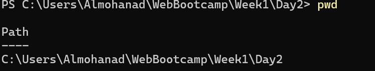
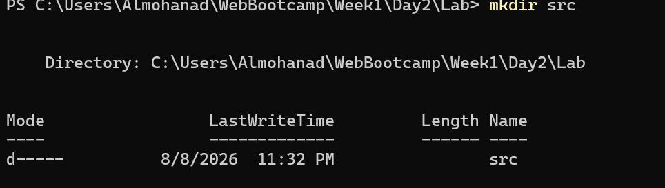
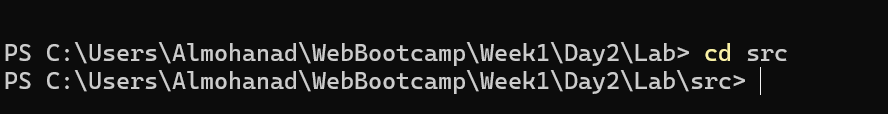
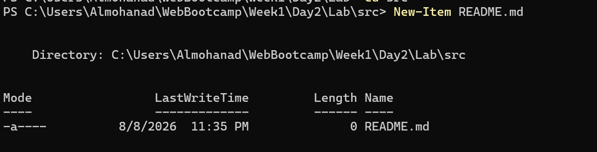
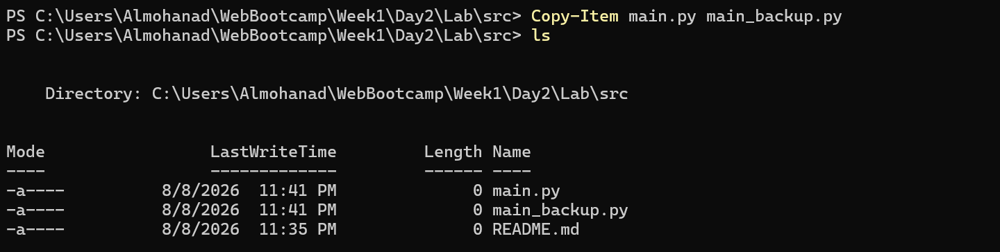
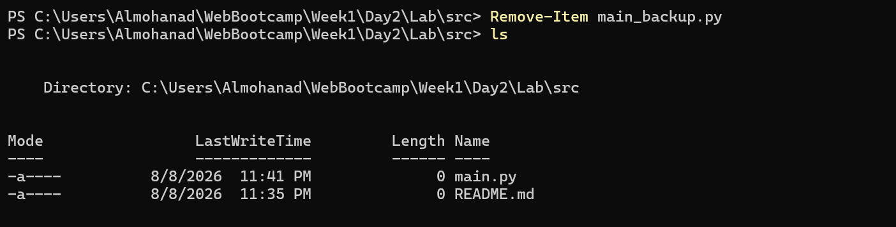
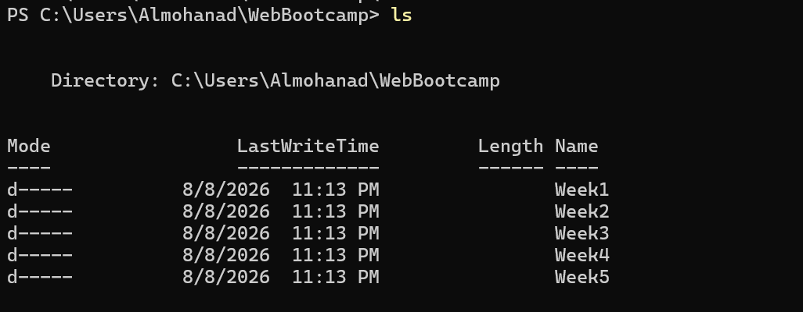
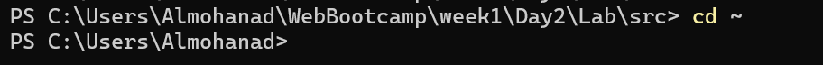
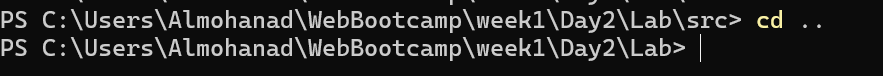

# 🚀 Week 1 - Day 2: PowerShell & Terminal Basics

This file documents the practical application of Command Line Interface (CLI) basics using PowerShell.

---

## 💻 Commands and Practical Application

### 1. `pwd` Command
**Description:** Print the current working directory to know your exact location in the file system.
**Example Usage:** `pwd`
**Application Image:**

---

### 2. `mkdir` Command
**Description:** Create a new directory (Make Directory).
**Example Usage:** `mkdir TestFolder`
**Application Image:**

---

### 3. `cd` Command
**Description:** Navigate into a specific directory (Change Directory).
**Example Usage:** `cd TestFolder`
**Application Image:**

---

### 4. `New-Item` (or `ni`) Command
**Description:** Create a new file or item.
**Example Usage:** `New-Item file.txt` or `ni file.txt`
**Application Image:**

---

### 5. `Copy-Item` Command
**Description:** Copy a file or directory from one location to another.
**Example Usage:** `Copy-Item file.txt copy_file.txt`
**Application Image:**

---

### 6. `Remove-Item` Command
**Description:** Delete a file or directory (The standard alternative to Delete-Item in Windows).
**Example Usage:** `Remove-Item file.txt`
**Application Image:**

---

### 7. `ls` Command
**Description:** List all contents of the current directory (files and folders).
**Example Usage:** `ls`
**Application Image:**

---

### 8. `cd ~` Command
**Description:** Navigate directly to the user's home directory.
**Example Usage:** `cd ~`
**Application Image:**

---

### 9. `cd ..` Command
**Description:** Move one step back to the parent directory.
**Example Usage:** `cd ..`
**Application Image:**

