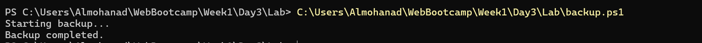
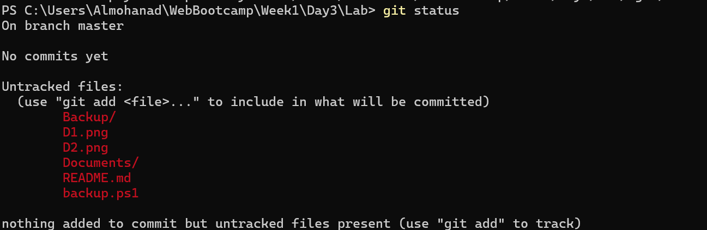
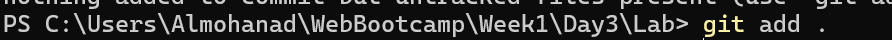
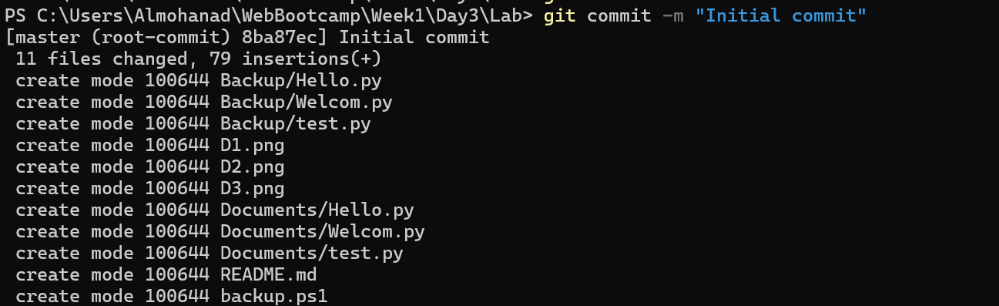
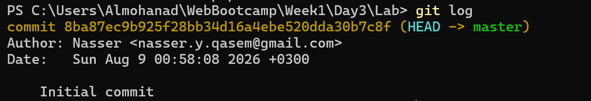
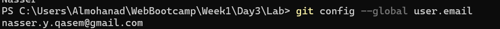

# 🚀 Week 1 - Day 3: Scripting & Git Basics

This file documents the practical application of PowerShell scripting for automation, followed by essential Git commands for version control and environment configuration.

---

## 💻 Commands and Practical Application

### 1. Backup Automation Script
**Description:** A simple PowerShell script to automate backing up files from a specific folder to another using `Copy-Item`.
**Application Image:**

---

### 2. `git init` Command
**Description:** Initialize a new, empty local Git repository in the current directory.
**Example Usage:** `git init`
**Application Image:**

---

### 3. `git status` Command
**Description:** Check the current state of the working directory and the staging area (shows modified, tracked, or untracked files).
**Example Usage:** `git status`
**Application Image:**

---

### 4. `git add` Command
**Description:** Add changes in the working directory to the staging area, preparing them for the next commit.
**Example Usage:** `git add .` (to add all files) or `git add filename.txt`
**Application Image:**

---

### 5. `git commit` Command
**Description:** Record the staged changes into the repository's history with a descriptive message.
**Example Usage:** `git commit -m "Initial commit"`
**Application Image:**

---

### 6. `git log` Command
**Description:** Display the commit history (logs) of the repository, showing the author, date, and commit messages.
**Example Usage:** `git log`
**Application Image:**

---

### 7. `git config --global user.name` Command
**Description:** Set or retrieve the global author name attached to your commit transactions.
**Example Usage:** `git config --global user.name "Your Name"`
**Application Image:**

---

### 8. `git config --global user.email` Command
**Description:** Set or retrieve the global author email attached to your commit transactions.
**Example Usage:** `git config --global user.email "your.email@example.com"`
**Application Image:**

