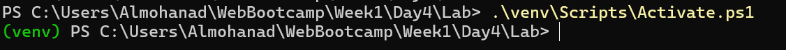
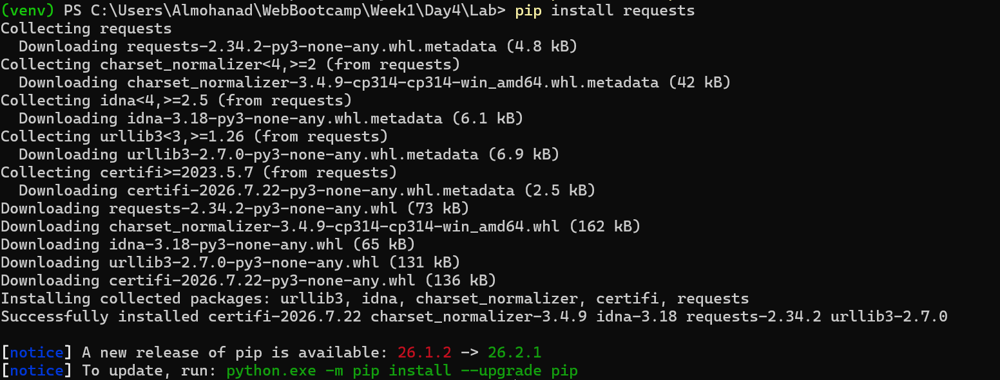
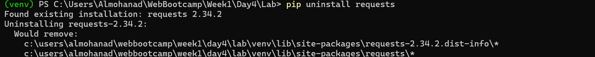
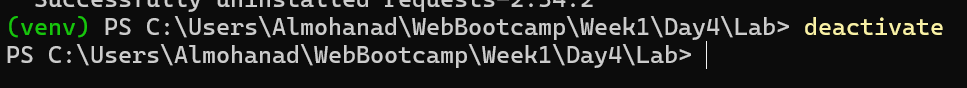

# 🚀 Week 1 - Day 4: Virtual Environments & Package Management

This file documents the practical application of Python virtual environments, package management using pip, and branching in Git.

---

## 💻 Commands and Practical Application

### 1. `python -m venv venv` Command
**Description:** Create a new Python virtual environment named "venv" to isolate project dependencies and packages.
**Example Usage:** `python -m venv venv`
**Application Image:**

---

### 2. `.\venv\Scripts\Activate.ps1` Command
**Description:** Activate the newly created virtual environment in PowerShell.
**Example Usage:** `.\venv\Scripts\Activate.ps1`
**Application Image:**

---

### 3. `pip install requests` Command
**Description:** Install external Python packages (like the `requests` library) into the active virtual environment.
**Example Usage:** `pip install requests`
**Application Image:**

---

### 4. `python -m pip freeze > requirements.txt` Command
**Description:** Export a list of all currently installed packages and their versions into a text file for easy sharing and project setup.
**Example Usage:** `python -m pip freeze > requirements.txt`
**Application Image:**

---

### 5. `pip uninstall requests` Command
**Description:** Uninstall a previously installed Python package (like the `requests` library) from the active virtual environment.
**Example Usage:** `pip uninstall requests`
**Application Image:**

---

### 6. `deactivate` Command
**Description:** Exit and deactivate the current Python virtual environment, returning to the normal command line environment.
**Example Usage:** `deactivate`
**Application Image:**

---

### 7. `git branch` Command
**Description:** List all local Git branches, or create a new branch to work on a separate feature without affecting the main code.
**Example Usage:** `git branch`
**Application Image:**

---