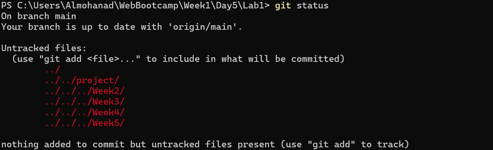
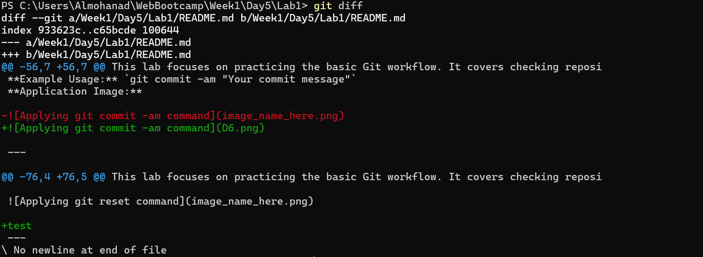
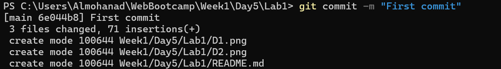
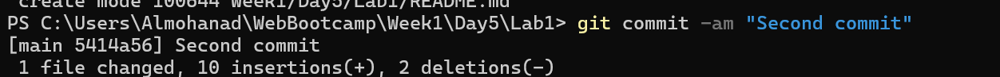
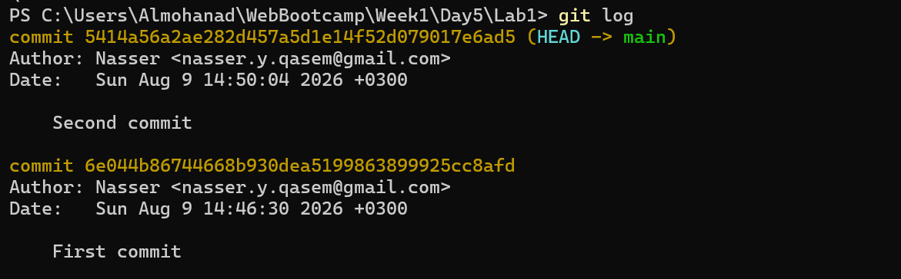
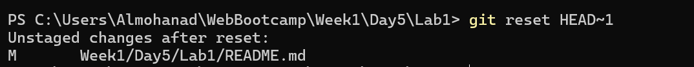

# 🚀 Week 1 - Day 5: Lab 1 - Track, Review, and Commit Changes

This lab focuses on practicing the basic Git workflow. It covers checking repository status, branching, reviewing file changes, staging, committing, viewing history, and undoing commits.

---

## 💻 Commands and Practical Application

### 1. `git status` Command
**Description:** Check the current state of the repository, including staged, unstaged, and untracked files.
**Example Usage:** `git status`
**Application Image:**

---

### 2. `git branch` Command
**Description:** Create a new branch or view existing branches in the repository.
**Example Usage:** `git branch`
**Application Image:**

---

### 3. `git diff` Command
**Description:** Review specific file changes and see exactly what was modified before staging.
**Example Usage:** `git diff`
**Application Image:**

---

### 4. `git add` Command
**Description:** Stage changes (add modified or new files to the staging area) to prepare them for a commit.
**Example Usage:** `git add .`
**Application Image:**

---

### 5. `git commit` Command
**Description:** Commit the staged changes to the repository's history with a descriptive message.
**Example Usage:** `git commit -m "Your commit message"`
**Application Image:**

---

### 6. `git commit -am` Command
**Description:** A shortcut command to automatically stage all tracked, modified files and commit them in a single step.
**Example Usage:** `git commit -am "Your commit message"`
**Application Image:**

---

### 7. `git log` Command
**Description:** View the chronological commit history of the repository.
**Example Usage:** `git log`
**Application Image:**

---

### 8. `git reset HEAD~1` Command
**Description:** Undo the very latest commit while keeping the file changes in the working directory.
**Example Usage:** `git reset HEAD~1`
**Application Image:**

---