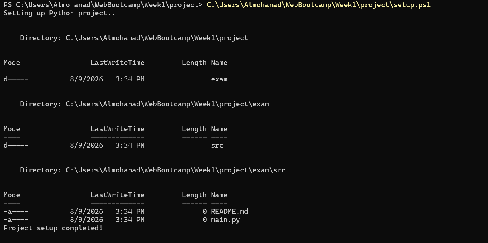

# 🚀 Project / Exam Documentation

This file documents the steps taken during the project execution, from creating the script to pushing the final code to GitHub.

---

## 💻 Practical Steps

### 1. Script Creation
**Description:** First, I created a script to automatically make folders and files.
**Application Image:**

---

### 2. Commit and Push to GitHub
**Description:** After that, I added a commit for the changes and successfully pushed the project to GitHub.
**Application Image:**

---