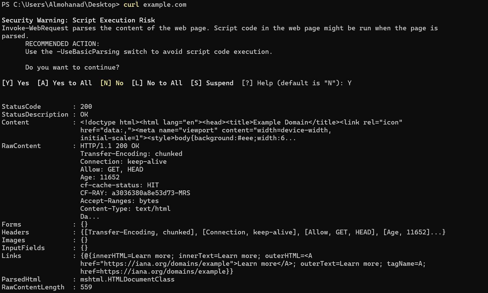
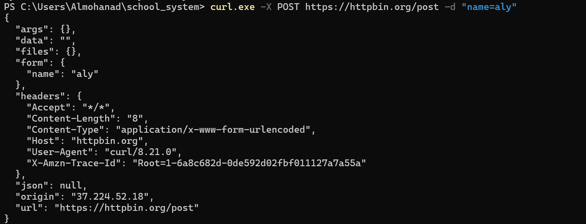
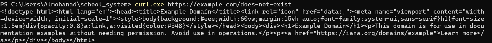

### 1. `curl` Command (Basic GET)
**Description:** Send a standard GET request to a website to retrieve its parsed content.
**Example Usage:** `curl example.com`
**Application Image:**

---

### 2. `curl.exe` Command (POST Request)
**Description:** Send form data to an API endpoint using the POST method.
**Example Usage:** `curl.exe -X POST https://httpbin.org/post -d "name=aly"`
**Application Image:**

---

### 3. `curl.exe` Command (Invalid Path)
**Description:** Test the server's response when requesting an invalid or non-existent URL path.
**Example Usage:** `curl.exe https://example.com/does-not-exist`
**Application Image:**

