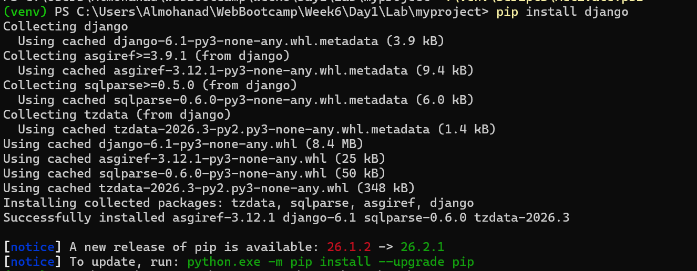
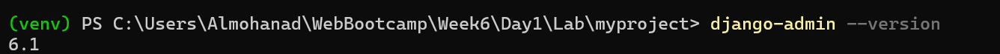
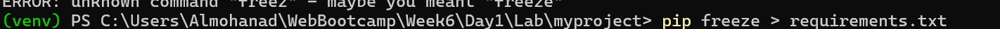
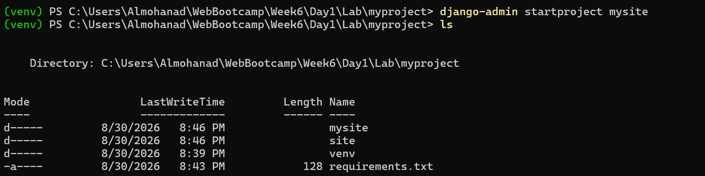
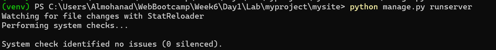

# 🚀 Week 6 - Day 1: Django Setup & Basics

This file documents the practical application of setting up a new Django project and managing dependencies.

---

## 💻 Commands and Practical Application

### 1. `pip install` Command
**Description:** Install the Django web framework within the active virtual environment.
**Example Usage:** `pip install django`
**Application Image:**

---

### 2. `django-admin --version` Command
**Description:** Verify the successful installation of Django and display the currently installed version.
**Example Usage:** `django-admin --version`
**Application Image:**

---

### 3. `pip freeze` Command
**Description:** Export all installed packages and their exact versions into a text file for project documentation and reproducibility.
**Example Usage:** `pip freeze > requirements.txt`
**Application Image:**

---

### 4. `django-admin startproject` Command
**Description:** Create the core directory structure and essential configuration files for a new Django project.
**Example Usage:** `django-admin startproject mysite`
**Application Image:**

---

### 5. `runserver` Command
**Description:** Launch the Django local development server to test and preview the web application in the browser.
**Example Usage:** `python manage.py runserver`
**Application Image:**

---