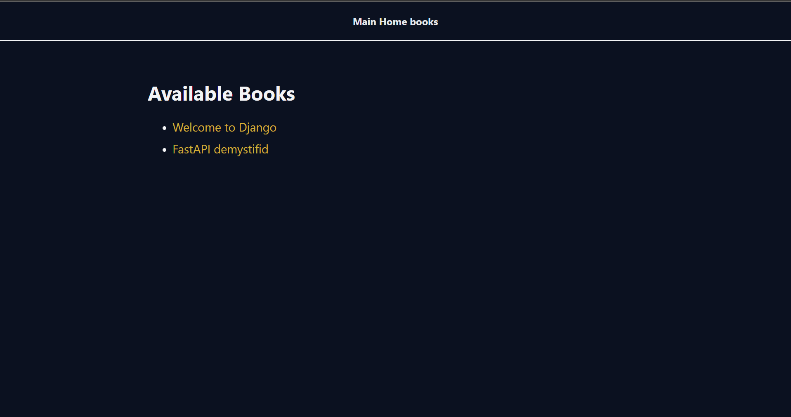

## 🔄 Django MVT (Model-View-Template) Data Flow

This structural diagram illustrates the Data Flow in the `library` app, from the user's initial page request until it is rendered on the browser:

```text
🧑‍💻 [User / Browser] 
       │
       │ 1. HTTP Request (e.g., visits /library/)
       ▼
🗺️ [urls.py] (URL Dispatcher)
       │
       │ 2. Matches URL and triggers the assigned View
       ▼
⚙️ [views.py] (View logic: e.g., book_list)
       │
       │ 3. Requests data            4. Returns Data
       ▼                               ▲
📦 [Data Source] (Model: In-Memory `books_db`)

⚙️ [views.py] (View logic resumes)
       │
       │ 5. Sends Data (Context) to Template
       ▼
🎨 [Templates] (Template: `book_list.html`)
       │
       │ 6. Combines HTML + CSS + Django Variables
       ▼
🧑‍💻 [User / Browser] <- 7. Final HTTP Response (Rendered Page) 
```





