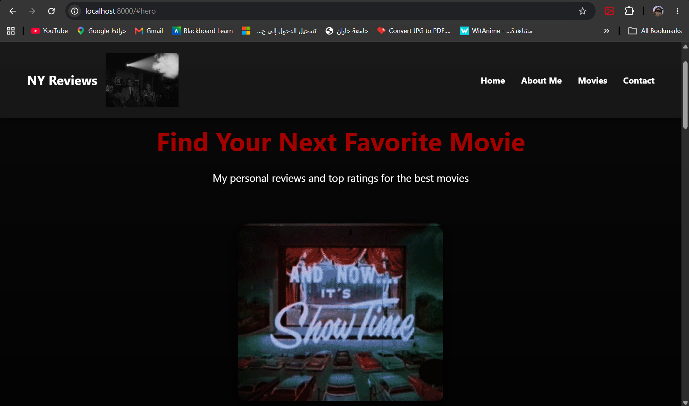
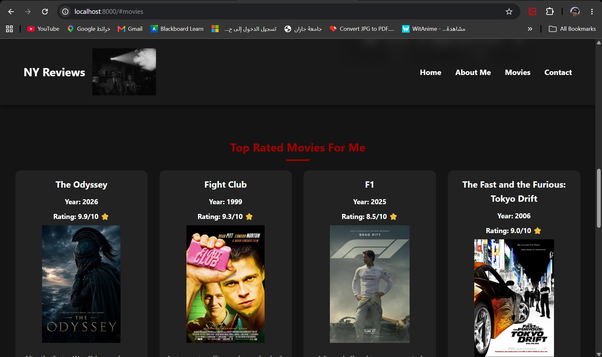
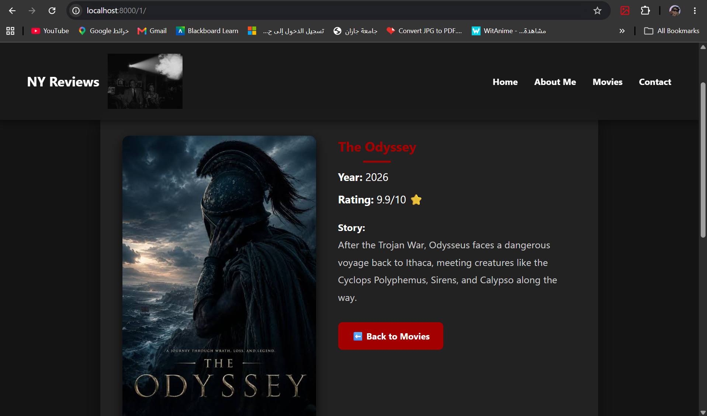

# 🎬 NY Reviews - Django Movies Challenge

"NY Reviews" is a personal movie review platform built with Django. It showcases a seamless integration of Front-end design (Flexbox, CSS variables, and anchor-scrolling) with Back-end logic using the Django MVT architecture.

## 📌 Features Included
1. **Global Template (`base.html`):** A shared layout containing a sticky header, navigation bar, and a functional footer with a contact form.
2. **Static Files Management:** Extensive use of the `` tag to load CSS, GIF animations, and movie posters.
3. **Template Filters:** Utilizing Django's `|truncatewords:15` filter to keep the movie grid clean and uniform.
4. **Dynamic Routing:** Passing specific IDs via URLs to render dedicated pages for each movie.
5. **Graceful Error Handling:** An `` condition in the details page that displays a custom error message if a movie ID is not found.

---

## 🔄 Django MVT (Model-View-Template) Data Flow

This structural diagram illustrates the Data Flow in the `movies` app, from the user's initial page request until it is rendered on the browser:

```text
🧑‍💻 [User / Browser] 
    │ 
    │ 1. HTTP Request (e.g., visits / or /2/)
    ▼
🗺️ [urls.py] (URL Dispatcher)
    │ 
    │ 2. Matches URL and triggers the assigned View
    ▼
⚙️ [views.py] (View logic: e.g., movie_detail)
    │ 
    │ 3. Requests data              4. Returns Data
    ▼                               ▲
📦 [Data Source] (Model: In-Memory `movies` list)

⚙️ [views.py] (View logic resumes)
    │ 
    │ 5. Sends Data (Context) to Template
    ▼
🎨 [Templates] (Template: `movie_list.html` / `movie_detail.html`)
    │ 
    │ 6. Combines HTML + CSS + Django Variables
    ▼
🧑‍💻 [User / Browser] <- 7. Final HTTP Response (Rendered Page)
```

---

## 📸 Project Screenshots

**1. Hero Section & About Me:**
*(Drag and drop your home page screenshot here, showing the NY Reviews header and animations)*


**2. Movies Grid Section:**
*(Drag and drop your movies grid screenshot here)*


**3. Dynamic Movie Detail View:**
*(Drag and drop the screenshot of a specific movie detail page here, showing the layout and poster)*
