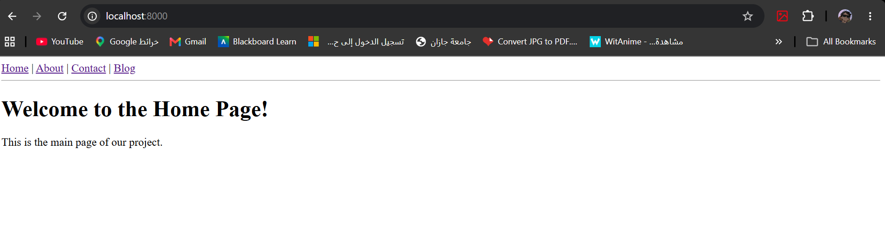
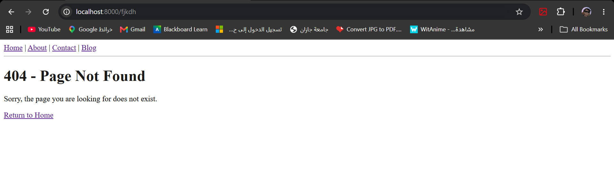
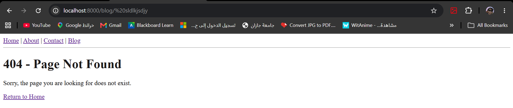

# Django Guided Lab: Pages & Blog Apps

This project is a demonstration of core Django concepts, including app creation, routing, namespaces, dynamic parameters, template inheritance, and custom error handling.

## 📌 Features Implemented
1. **Pages App:** Static pages (Home, About, Contact).
2. **Blog App:** Dynamic pages (Post List, Post Detail, Category).
3. **Template Inheritance:** A global `base.html` used across all apps.
4. **URL Namespaces & Dynamic Parameters:** Using `<int:post_id>` and `<str:category_name>`.
5. **Dynamic Links:** Using `` in templates.
6. **Custom Error Handling:** A custom 404 Not Found page.

---

## 🔄 Django Data Flow (How it works)

In this project, we followed the Django **MVT (Model-View-Template)** architecture. Here is a simple explanation of the Data Flow when a user clicks on a dynamic blog post link (e.g., Post 1):

```text
🧑‍💻 [User / Browser] 
    │ 
    │ 1. User clicks: <a href="/blog/post/1/">Post 1</a>
    ▼
🗺️ [urls.py] (URL Dispatcher)
    │ 
    │ 2. Matches the path: path('post/<int:post_id>/') 
    │ 3. Captures the dynamic parameter: post_id = 1
    ▼
⚙️ [views.py] (View Logic)
    │ 
    │ 4. Triggers: detail_view(request, post_id=1)
    │ 5. Prepares Context: {'post_id': 1}
    ▼
🎨 [Templates] (detail.html)
    │ 
    │ 6. Injects the context into the HTML: {{ post_id }}
    │ 7. Merges with base.html
    ▼
🧑‍💻 [User / Browser] <- 8. Returns the final Rendered Page
```


### 🔄 Flow Explanation

1. **Request:** The user navigates to a specific URL.
2. **Routing:** Django checks the project `urls.py`, then the app `urls.py`, matching the requested path and extracting any dynamic variables.
3. **View:** The designated Python function runs, processes the variables, and decides which HTML template to load.
4. **Template:** The HTML file renders the data and sends a complete web page back to the user's browser.









