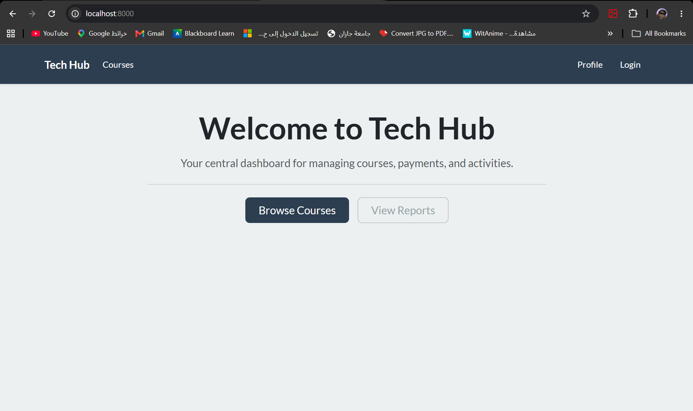
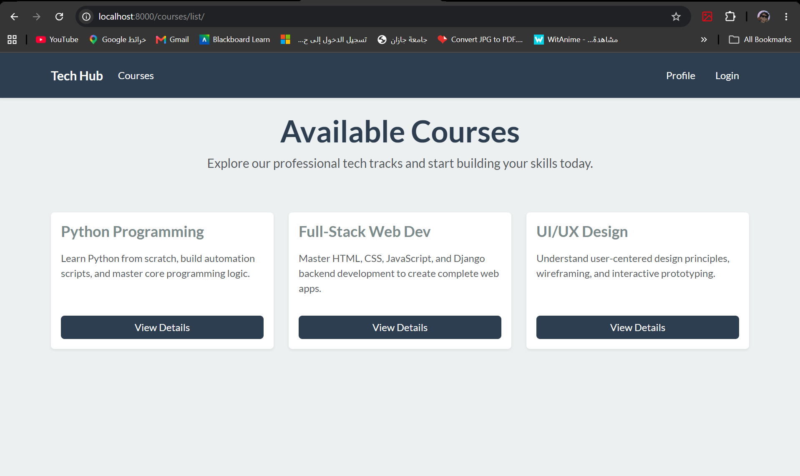
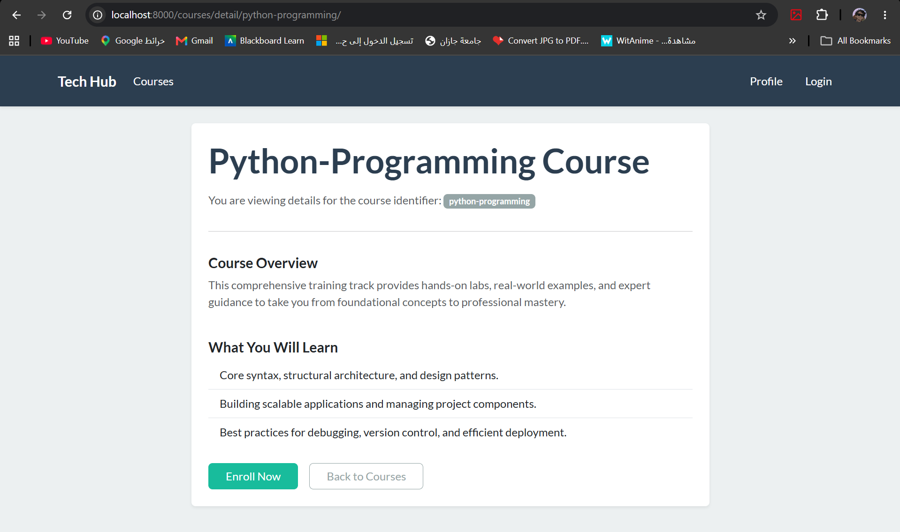
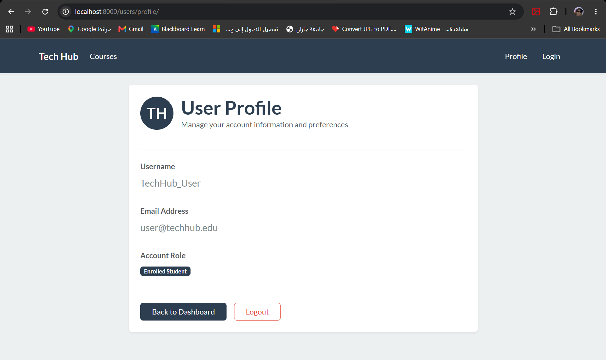
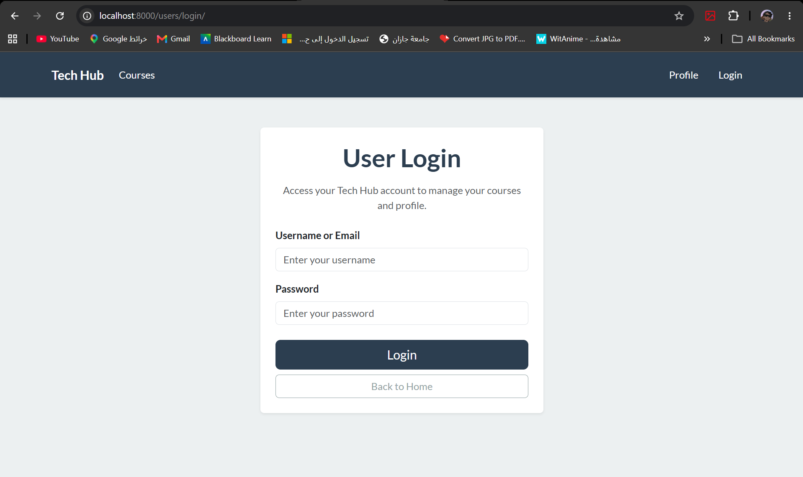
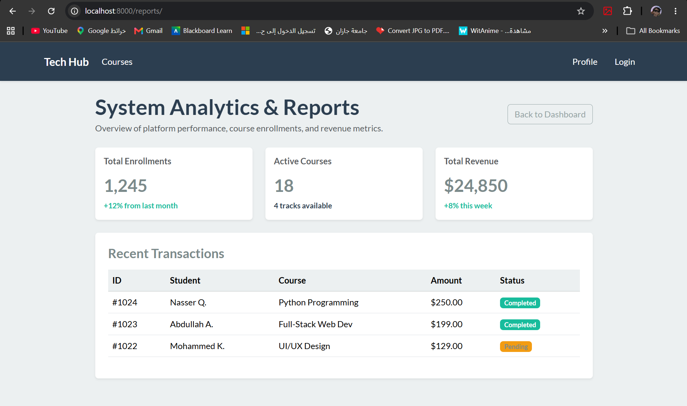
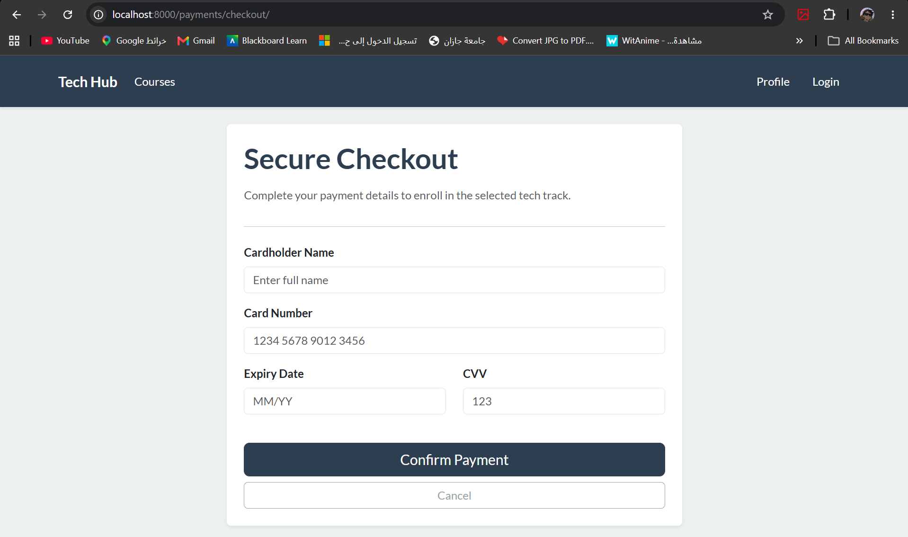
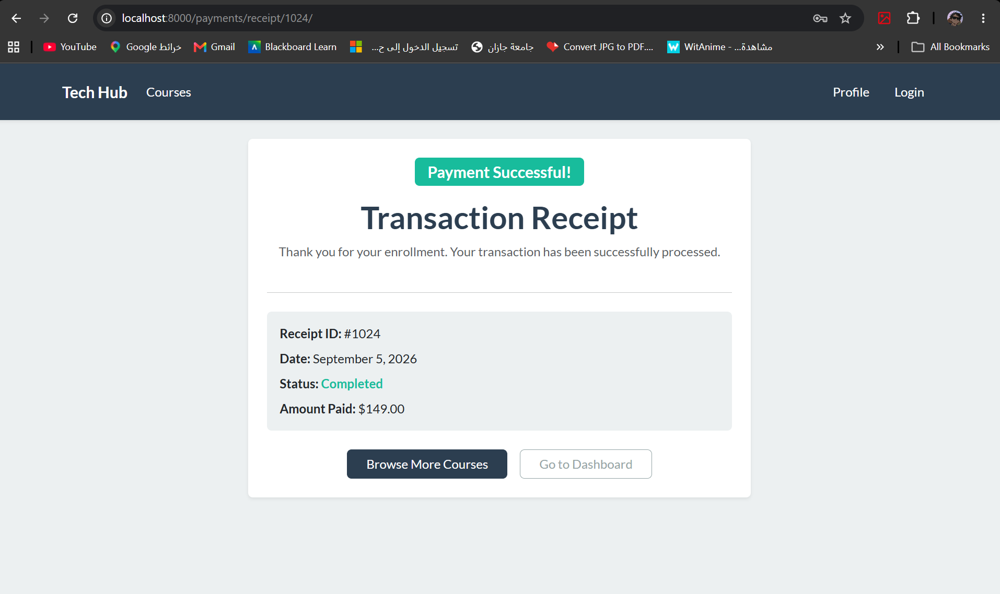

# Django Lab_challeng: Tech Hub Project

This project is a comprehensive demonstration of core Django concepts, featuring a multi-app architecture, dynamic URL routing, context rendering, template inheritance, and Class-Based Views (CBVs).

## 📌 Features Implemented
1. **Multi-App Architecture:** Four interconnected apps: `dashboard`, `courses`, `payments`, and `users`.
2. **Template Inheritance:** A global layout structured through `base.html`.
3. **Dynamic URL Parameters:** Extensive use of URL capturing across different data types:
   - `<slug:slug>` for Course Details.
   - `<str:category_name>` for Course Categories.
   - `<int:receipt_id>` for Transaction Receipts.
4. **URL Namespaces:** Isolated app routing using `app_name` (e.g., `courses:detail`, `payments:receipt`).
5. **Class-Based Views (CBV):** Implementation of `ReportsView(View)` alongside standard Function-Based Views (FBV).

---

## 🔄 Django Data Flow (Architecture Overview)

The project follows the Django **MVT (Model-View-Template)** pattern. Below is the complete data flow mapping how the system handles various requests across all four applications:

```text
🧑‍💻 [User / Browser] 
    │ 
    │ 1. User Requests a URL (e.g., /courses/detail/python-basics/ OR /dashboard/reports/)
    ▼
🗺️ [Main urls.py] -> [App urls.py] (URL Dispatcher)
    │ 
    │ 2. Main URLs route the request to the specific app ('dashboard/', 'courses/', etc.)
    │ 3. App URLs match the exact path and extract any dynamic parameters (slug, str, int)
    ▼
⚙️ [views.py] (View Logic)
    │ 
    │ 4. Triggers the matching View:
    │    ├─ FBV: course_detail(request, slug='python-basics')
    │    └─ CBV: ReportsView.as_view() -> get(self, request)
    │ 5. Prepares Context Dictionaries: {'slug': slug}, {'receipt_id': receipt_id}, etc.
    ▼
🎨 [Templates] (HTML Files)
    │ 
    │ 6. Injects context variables directly into the HTML (e.g., {{ slug }}, {{ category_name }})
    │ 7. Merges app-specific templates (detail.html, receipt.html) with base.html
    ▼
🧑‍💻 [User / Browser] <- 8. Returns the final Rendered Page
```

### 🔄 Detailed Flow Explanation
1. **Request & Dispatching**: When a URL is visited, Django checks the main project urls.py. Based on the prefix (e.g., courses/), it forwards the request to the respective app's urls.py file using the include() function.

2. **Dynamic Routing**: Inside the app (like courses or payments), the path checks for dynamic variables. For example, path('detail/<slug:slug>/', ...) captures the course name, and path('receipt/<int:receipt_id>/', ...) captures the exact receipt number.

3. **View Processing**: The specific view function (e.g., category_view or receipt_view) is executed. It takes the request and the captured parameters, and passes them as a Python dictionary (context) into the render function.

4. **Template Rendering**: Django opens the designated HTML template, replaces the tags (like {{ receipt_id }}) with the actual data from the view, applies the base.html layout, and sends the fully constructed webpage back to the user.























