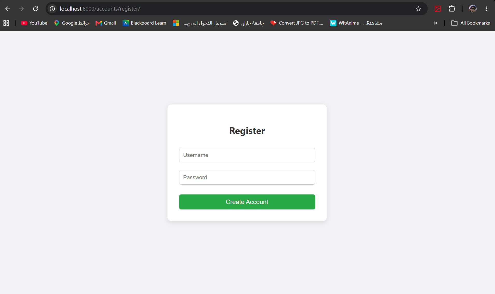
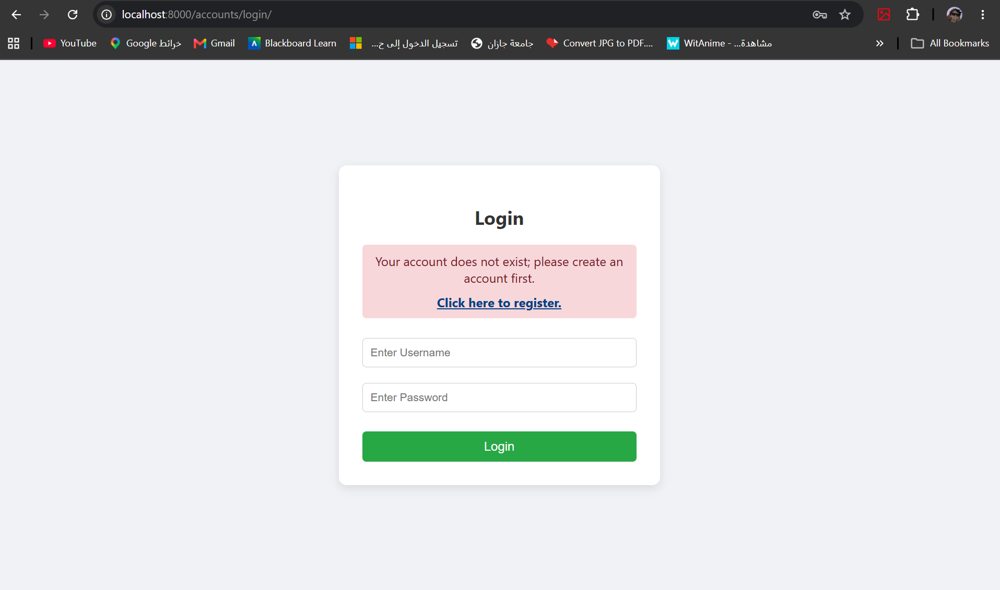
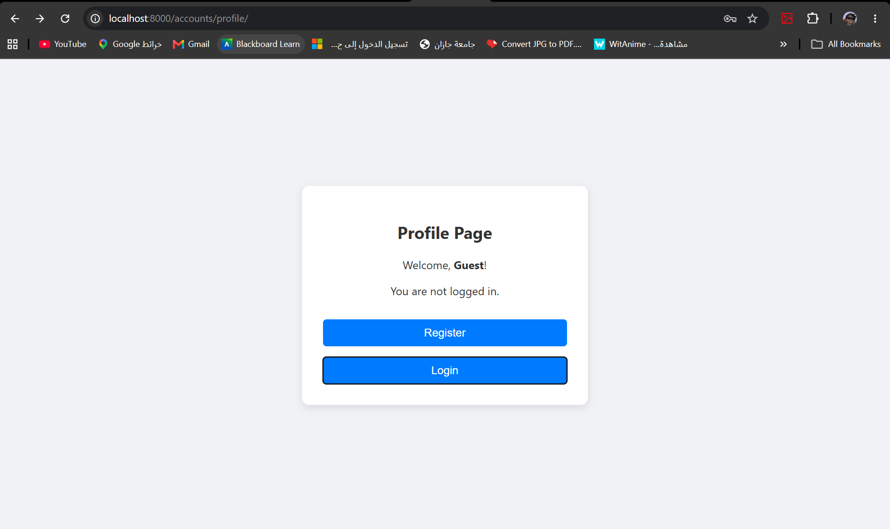
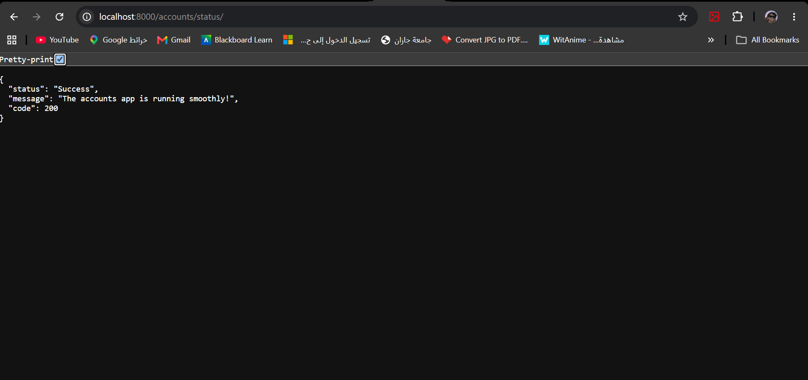

# Django Accounts Application - Guided Lab

## 📌 Project Overview
This project is a Django-based application that manages user sessions without relying on a full database model for authentication. It utilizes Django's `request.session` to handle user state (Login, Register, Logout) and demonstrates URL routing, template rendering, and error handling.

---

## 🔄 Data Flow & Application Workflow

Here is a step-by-step explanation of the data flow and how the application handles user requests:

### 1. Registration (`/accounts/register/`)
* **Action:** The user enters their username and password in the registration form.
* **Data Flow:** The form sends a `POST` request to the `RegisterView`. Django extracts the data using `request.POST.get()`. The username is then saved into the browser's temporary storage using `request.session['username']`.
* **Result:** The user is redirected to the Profile page as a logged-in user.

> **Screenshot:**
> 

### 2. Login & Error Handling (`/accounts/login/`)
* **Action:** An existing user tries to log in, or an unregistered user attempts to access the system.
* **Data Flow:** The `LoginView` receives the `POST` request. It safely checks the active session using `request.session.get('username')`. 
  * If the session is empty (user does not exist), the view intercepts the request and re-renders the HTML page, passing an `error` context variable.
  * The template `login.html` catches this variable and dynamically displays a red warning message with a quick link to the registration page.
  * If the credentials match the session, the user is redirected to their profile.

> **Screenshot:**
> 

### 3. Profile & Dashboard (`/accounts/profile/`)
* **Action:** The user views their profile dashboard.
* **Data Flow:** The `ProfileView` evaluates the state of the user based on the session. By using Django template tags (``), the UI dynamically changes:
  * **Logged out (Guest):** Shows "Register" and "Login" buttons.
  * **Logged in:** Greets the user by their name and displays options to check the server status or logout.

> **Screenshot:**
> 

### 4. Checking Status JSON (`/accounts/status/`)
* **Action:** The user clicks the "Check Status JSON" button.
* **Data Flow:** The request is routed to a function-based view (`status_view`). Instead of rendering an HTML template, this view returns a `JsonResponse` dictionary `{'status': 'ok'}`, simulating an API endpoint.

> **Screenshot:**
> 

### 5. Logout (`/accounts/logout/`)
* **Action:** The user clicks the red "Logout" button.
* **Data Flow:** The request goes to the `LogoutView`, which executes `request.session.flush()`. This command completely wipes the user's session data from the server and browser memory.
* **Result:** The user is redirected back to the Profile page, which now defaults to the "Guest" view.

---

## 🎨 UI/UX Improvements
* Replaced default blank HTML pages with a modern, centered CSS Card layout in `base.html`.
* Added conditional rendering to hide login/register buttons when a user is already authenticated.
* Implemented user-friendly error messages during the login process to prevent dead-ends (avoiding `KeyError`).