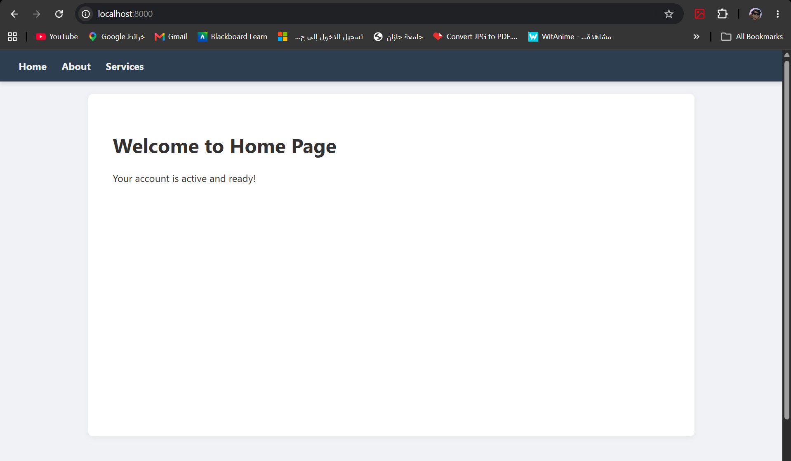
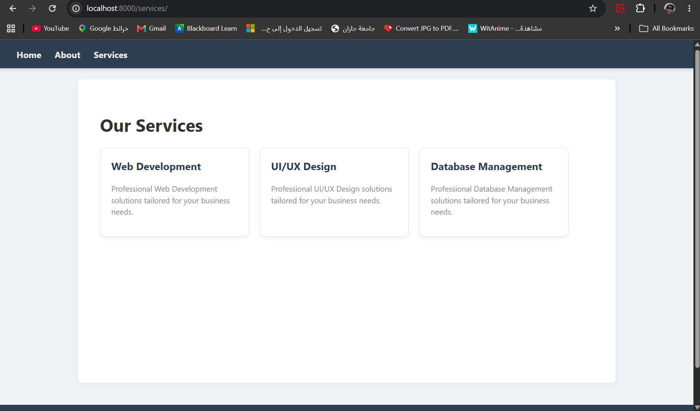

# Django Dynamic Multi-Pages UI - Lab Project

## 📌 Project Overview
This project demonstrates how to build a dynamic, reusable, and modular user interface using Django's templating engine. It focuses on template inheritance, context passing, static CSS integration, and modular UI components (Navbar & Cards).

---

## 🔄 Data Flow & Application Workflow

Here is a step-by-step breakdown of how data moves through the application when a user interacts with it:

### 1. The Request & URL Routing (`urls.py`)
* **Action:** The user clicks a link in the Navbar (e.g., ``) or types the URL directly.
* **Data Flow:** Django's URL dispatcher receives the request, matches the path (e.g., `/services/`), and routes it to the corresponding function in `views.py`.

### 2. View Logic & Context Preparation (`views.py`)
* **Action:** The view function (`services_view`) is triggered.
* **Data Flow:** The function prepares a Python dictionary called `context` containing dynamic data (e.g., a list of services, a page title, or an active status). This context is then passed to the `render()` function alongside the target HTML file.

### 3. Template Rendering & Component Integration (`templates/`)
* **Action:** Django begins rendering the HTML template.
* **Data Flow:**
  * **Inheritance:** The page (e.g., `services.html`) inherits the main structure and CSS links from `base.html` using ``.
  * **Components:** Reusable parts like `_navbar.html` and `_card.html` are dynamically injected into the layout using ``.
  * **Logic:** Django Template Language (DTL) processes the context. It uses `` to check statuses, `` to loop through the services list to generate UI Cards, and filters like `|upper` to format text.

### 4. The Final Response
* **Action:** The fully assembled HTML page is sent back to the browser.
* **Data Flow:** The browser renders the HTML and fetches the linked static CSS file (``) to apply the visual styling, presenting a complete, dynamic webpage to the user.

---

## 📸 Project Screenshots

### 1. Home Page (Demonstrating If-Conditions & Filters)
> 

### 2. Services Page (Demonstrating For-Loops & Card Components)
> 

