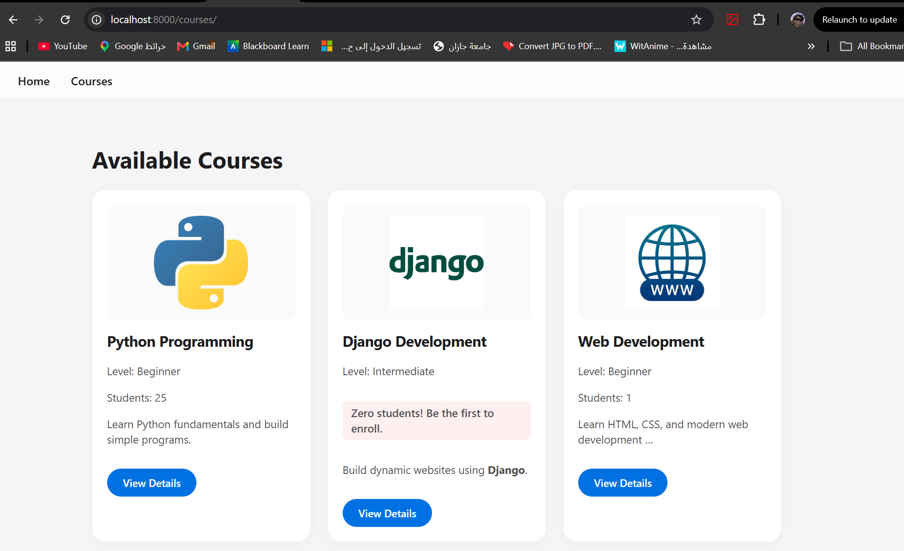
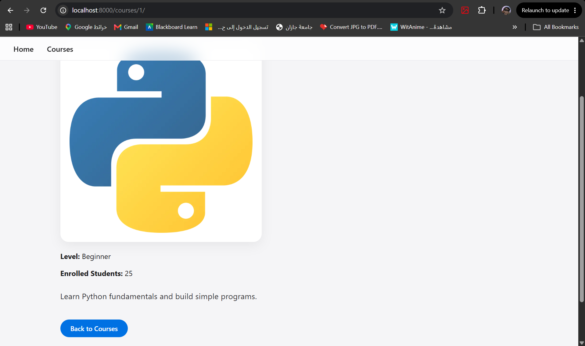
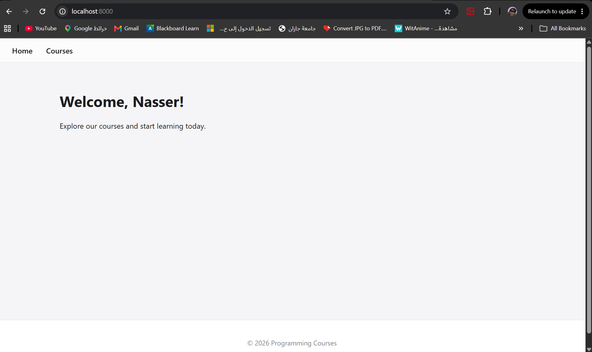

# Django Dynamic UI Challenge - Course Platform

## 📌 Project Overview
A dynamic, multi-page web application built with Django. This project demonstrates advanced usage of the Django Template Language (DTL), template inheritance, dynamic routing, and data passing through views. The application features a clean, user-centered interface with glassmorphism effects and modern styling principles.

## ✨ Features
* **Dynamic Routing:** Specific URLs for individual course detail pages using dynamic ID capturing (`/courses/<int:course_id>/`).
* **Modular Templates:** Extensive use of `` and `` for reusable UI components (e.g., Navbar, Course Cards).
* **DTL Logic & Filters:** 
  * Conditional rendering (``) to highlight courses with zero enrolled students.
  * Fallback states (``) for empty course lists.
  * Text formatting filters (`title`, `safe`, `truncatewords_html`) to cleanly render HTML content stored in the backend.
* **Modern UI/UX:** A clean, responsive design utilizing soft shadows, rounded corners, and smooth hover transitions for an optimal user experience.

---

## 🔄 Data Flow Architecture (MVT)

Understanding how data moves through this application when a user views a specific course:

1. **User Request (URL Dispatcher):**
   * The user clicks "View Details" on a course card.
   * The browser sends a request to a dynamic URL like `http://localhost:8000/courses/1/`.
   * Django's `urls.py` captures the integer `1` and routes the request to the `course_detail` view.

2. **Data Processing (Views & Logic):**
   * The `course_detail` function in `views.py` receives the request and the `course_id`.
   * A Python `for` loop iterates through the list of course dictionaries to find the specific course matching that ID.
   * The matching course data (name, level, student count, description, image) is packaged into a `context` dictionary.

3. **Template Rendering (DTL):**
   * The view passes the context to `course_detail.html`.
   * The template engine inherits the layout from `base.html`.
   * It injects the context variables (e.g., `{{ course.name }}`) and applies filters (e.g., `{{ course.description|safe }}`) to render strong tags correctly.

4. **Response & Styling:**
   * The final HTML is generated and sent to the browser.
   * The browser fetches the linked static CSS and images, rendering the styled detail page to the user.

---

## 📸 Screenshots

### 1. Courses Catalog Page
*(Shows the list of dynamic cards and the conditional zero-student alert)*
> 

### 2. Course Detail Page
*(Demonstrates dynamic routing, image rendering, and safe HTML text)*
> 

### 3. Home Page
*(Displays personalized welcome message with string filters)*
> 

---
**Developed by Nasser | 2026 Django Challenges**