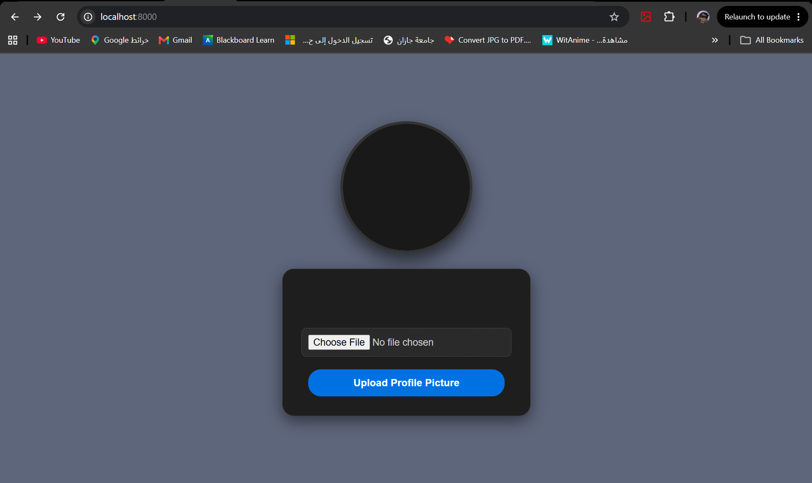
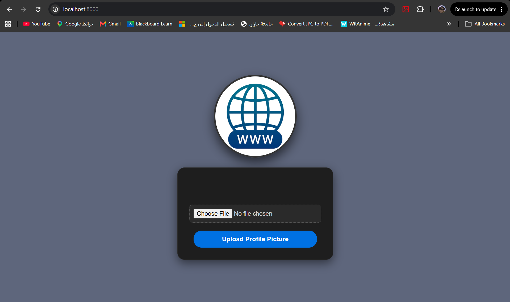

# Django Static & Media Files Lab 📂✨

## 📌 Project Overview
A complete Django web application demonstrating the architecture and configuration of static assets (CSS, UI Images) and user-uploaded media files. The project features a custom-built, modern **Dark Mode UI** for a seamless profile picture upload experience.

## 🔄 Data Flow Architecture (File Upload Lifecycle)

Understanding how files travel from the user's browser to the Django server:

1. **Initial Request (Static Files):** 
   When the user visits the page, Django renders the HTML template. The static CSS file and the `default-avatar.png` are served from the configured `STATIC_URL`.
2. **User Submission (Client-Side):** 
   The user selects an image and clicks upload. The HTML `<form>` uses the crucial `enctype="multipart/form-data"` attribute, allowing the browser to encode and send binary file data securely via a `POST` request.
3. **Backend Processing (Views & `request.FILES`):** 
   Django intercepts the request. The view logic extracts the uploaded file from the `request.FILES` dictionary.
4. **Storage (`FileSystemStorage`):** 
   Django's built-in file system storage engine takes the file and physically saves it into the designated `MEDIA_ROOT` directory on the server.
5. **Dynamic Response (Template Rendering):** 
   The view generates a secure URL (via `fs.url()`) pointing to the newly saved media file. This URL is passed as context back to the template, instantly updating the user's avatar on the screen.

---

## 🛠️ Step-by-Step Implementation

This project was built following a strict 8-step configuration guide:

1. **Static Configuration:** Defined `STATIC_URL`, `STATICFILES_DIRS`, and `STATIC_ROOT` in `settings.py`.
2. **Asset Creation:** Developed a custom Dark Mode `main.css` and added a fallback `default-avatar.png`.
3. **Media Configuration:** Configured `MEDIA_URL` and `MEDIA_ROOT` for dynamic user uploads.
4. **URL Routing:** Appended media serving capabilities to `urls.py` specifically for `DEBUG` mode.
5. **Form Architecture:** Built a secure HTML form utilizing `enctype="multipart/form-data"` and CSRF tokens.
6. **View Logic:** Handled file parsing using `request.FILES` in `views.py`.
7. **Template Logic:** Implemented DTL `` conditions to toggle between the uploaded image and the static default avatar.
8. **Deployment Readiness:** Executed `python manage.py collectstatic` to aggregate all static assets into a single deployment-ready directory.

---

## 📸 Project Screenshots

### 1. Default State (Dark Mode UI)
*(Displays the clean dark UI with the default static avatar before any upload)*
> 

### 2. File Selection & Upload
*(Demonstrates the file input interaction and the uploaded media rendering)*
> 

---
**Developed by Nasser | 2026 Full-Stack Django Labs**