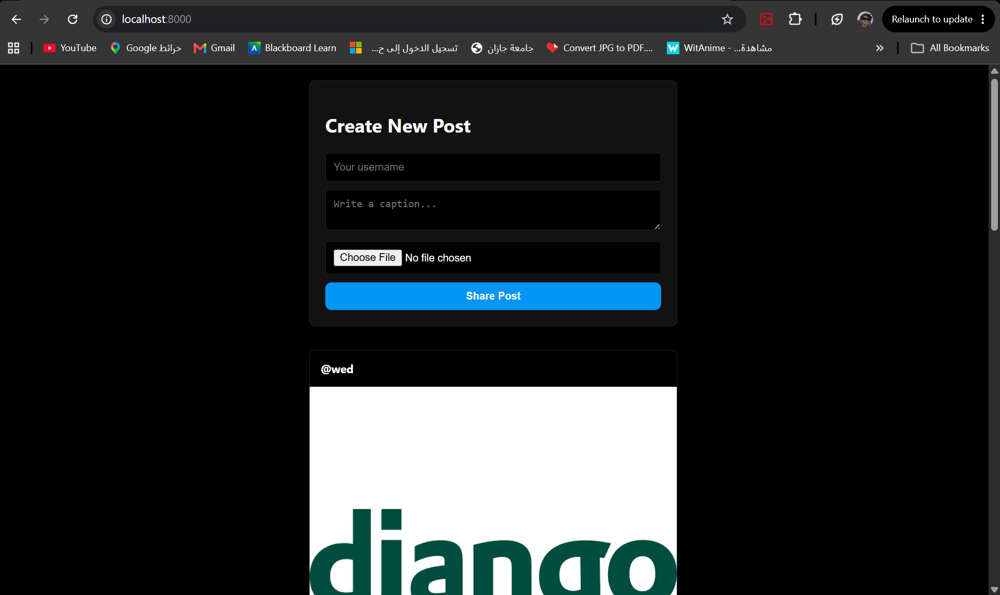
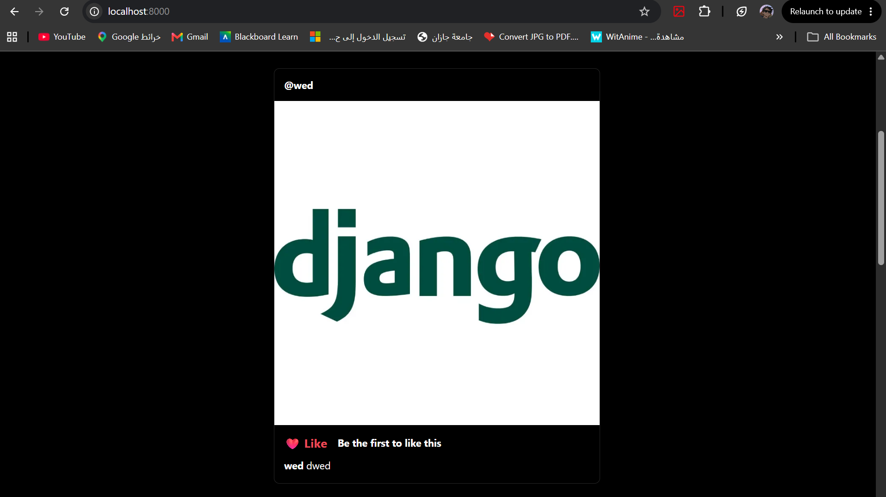
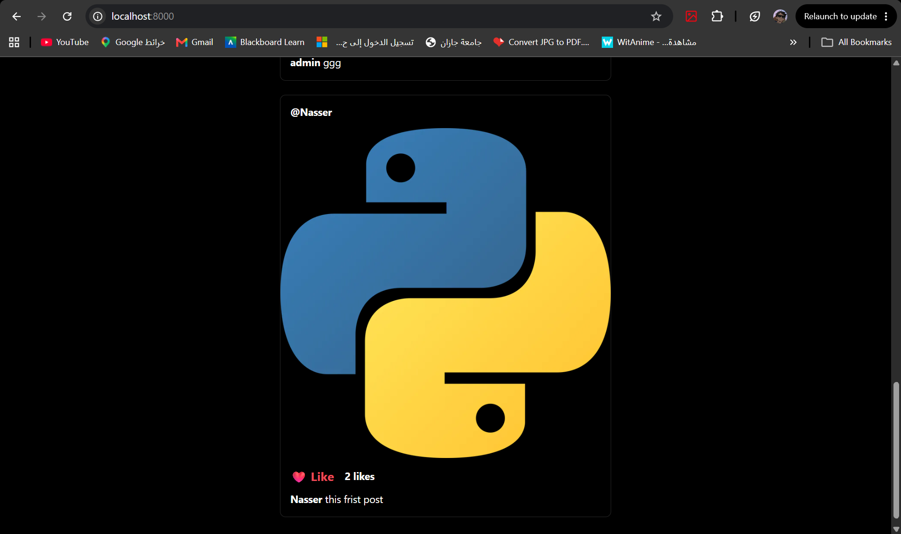

# 📸 Mini Instagram Clone - Django

## 📌 Project Overview
A full-stack Django web application that replicates the core functionality of an Instagram feed. This project demonstrates proficiency in handling user-generated media, database modeling, file validation, and interactive UI logic, all wrapped in a custom, modern **Dark Mode** interface.

---

## 🔄 Data Flow Architecture

Understanding how data moves through this application:

1. **Client Submission:** The user fills out the upload form. The HTML `<form>` uses `enctype="multipart/form-data"` to securely transmit text data (username, caption) and binary data (the image file) via a POST request.
2. **Server-Side Validation (Views):** Django intercepts the request. The backend logic extracts the file from `request.FILES` and validates the file extension (ensuring only `.jpg`, `.jpeg`, and `.png` are accepted). Invalid files trigger an error message without hitting the database.
3. **Database Storage (Models):** Upon successful validation, a new `Post` record is created in the SQLite database. Text fields are stored in the table, while the image is routed to the server's file system (`media/posts/`), saving only the file path in the database.
4. **Feed Rendering:** When rendering the feed, Django queries `Post.objects.all()` and injects the dataset into the template. The DTL (Django Template Language) dynamically loops through the posts, linking the `media` URLs to display the images.
5. **Interactive Actions (Likes):** Clicking the "Like" button triggers a GET request to a dynamic URL (`/like/<id>/`). The backend retrieves the specific post, increments the integer field in the database by `1`, saves it, and instantly redirects the user back to the updated feed.

---

## 🛠️ Step-by-Step Implementation

Here is a breakdown of how this project was built from scratch:

### 1. Database Design (Models)
* Created a `Post` model with fields for `username`, `description`, `image`, and a `likes` counter (defaulting to 0).
* Configured `ImageField` to automatically route uploaded images to a specific `posts/` directory inside the media root.

### 2. Media & Static Configuration
* Configured `MEDIA_URL` and `MEDIA_ROOT` in `settings.py` to handle dynamic user uploads.
* Updated the main project `urls.py` with `static()` settings to serve media files securely during development.

### 3. Business Logic (Views & Validation)
* Built a `feed_view` to handle both displaying posts (GET) and processing new uploads (POST).
* Implemented strict backend validation to reject non-image file types (e.g., PDFs).
* Created a dedicated `like_post` view to handle the increment logic and database updates.

### 4. Template & Challenge Logic (DTL)
* Designed a responsive feed layout.
* **Completed the Lab Challenge:** Used Django Template conditionals (``) to dynamically switch the UI text from *"Be the first to like this"* to showing the actual like count once interacted with.

### 5. UI/UX Design (Dark Mode)
* Styled the application using a custom Dark Mode CSS, matching the aesthetic of modern social media platforms with dark backgrounds, precise borders, and responsive image sizing.
* Ran `collectstatic` to ensure all styling assets are deployment-ready.

---

## 📸 Screenshots

### 1. The Feed & Like Challenge
*(Displays the image rendering and the dynamic "Be the first to like this" text)*
> 

### 2. 

>

### 3. 

>
---
**Developed by Nasser | 2026 Django Full-Stack Labs**