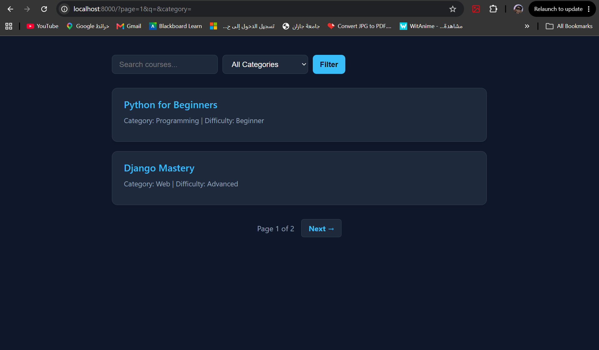
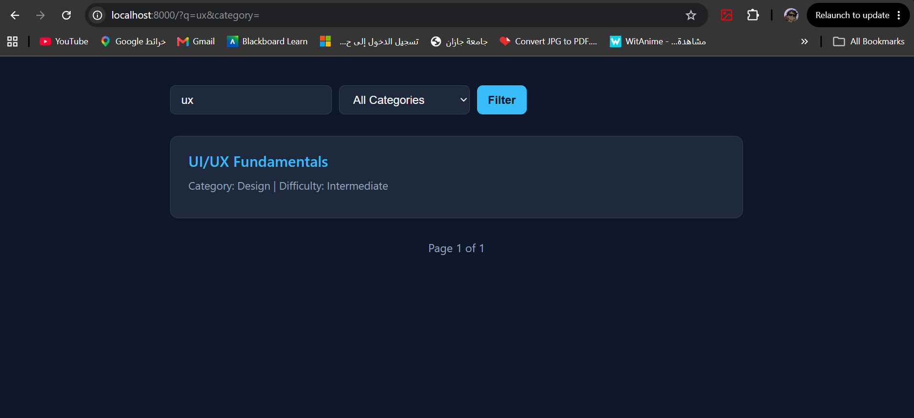

# 📚 Parameter-Aware Course Catalog

## 🔄 Data Flow Architecture
* **Client Request:** The user interacts with the search form or pagination, triggering a GET request containing query parameters (e.g., `?q=python&category=web`).
* **View Processing (`views.py`):** Django intercepts the request and extracts the parameters securely using `request.GET.get()`, providing safe fallback values for empty inputs.
* **Data Filtering:** Python list comprehensions dynamically filter the backend `MOCK_COURSES` dictionary array based on the active search and category criteria.
* **Template Rendering:** The filtered dataset and pagination object are passed to the Django Template Language (DTL), rendering the HTML alongside an external Dark Mode CSS file.

## 🛠️ Step-by-Step Implementation
* Initialized the `courses` app and constructed a robust mock data structure to simulate a database.
* Configured URL routing for the main catalog list and dynamic ID-based detail routes.
* Built a comprehensive search mechanism that parses the `q` parameter for title matching.
* Addressed critical edge cases by intercepting literal `None` values in the category filter to prevent logic errors.
* Integrated Django's `Paginator` to manage data rendering, ensuring query parameters persist across different pages.
* Engineered a dynamic tab system for the detail view using the `?tab=` parameter to switch between Details, Syllabus, and Instructor content without reloading new templates.
* Isolated all visual styling into a dedicated `static/css/style.css` file for a maintainable, modern dark interface.
* Refactored list comprehensions to use descriptive variable naming for enhanced code readability.

## 📸 Screenshots Showcase

