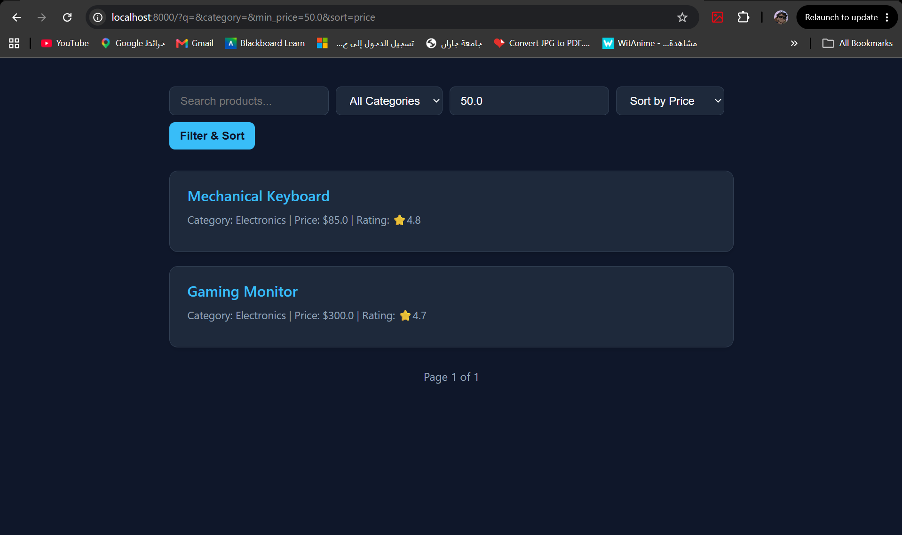
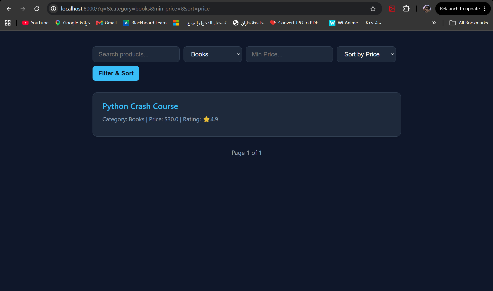
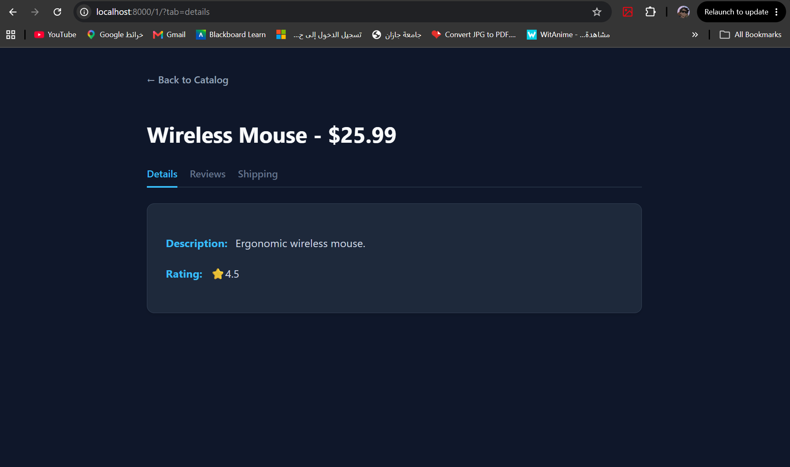

# 🛒 Parameter-Aware Product Explorer

## 🔄 Data Flow Architecture & Validation
* **Client Request:** The user interacts with multiple form controls (search bar, dropdowns, number inputs) which submit a unified GET request containing various query parameters (e.g., `?q=mouse&category=electronics&min_price=20&sort=price`).
* **Safe Parameter Extraction (`views.py`):** 
  * Django safely extracts the parameters.
  * **Price Validation:** The `min_price` parameter undergoes a `try-except ValueError` block. If a user tampers with the URL and inputs a string instead of a number, the backend gracefully ignores it without crashing (Server Error 500).
  * **Sort Validation:** The `sort` parameter is cross-referenced with a predefined list of `valid_sort_fields`. Invalid values automatically fall back to the default 'name' sorting.
* **Data Processing & Sorting:** Python filters the `MOCK_PRODUCTS` array based on the validated criteria, then applies a `lambda` function to sort the remaining dictionaries dynamically.
* **Template Rendering (Clean URLs):** The pagination system reconstructs the URL parameters for the next/previous pages. It uses inline `` conditional tags to omit empty parameters, ensuring clean and readable URLs.

## 🛠️ Step-by-Step Implementation
* Initialized the `products` app and populated it with comprehensive mock data, including prices, ratings, and varying descriptions.
* Configured robust URL routing for the product list and detail views.
* Developed a multi-criteria filtering system:
  * **Text Search (`q`):** Scans both product names and descriptions.
  * **Category Filter:** Performs exact string matching.
  * **Minimum Price:** Uses safe float conversion for threshold filtering.
* Engineered a secure sorting mechanism (Price, Rating, Name) that defaults safely if provided with invalid query data.
* Implemented Django `Paginator` with advanced template logic to preserve all active search, filter, and sort parameters across pages without cluttering the URL with empty keys.
* Built a detail view with dynamic `?tab=` navigation (Details, Reviews, Shipping).
* Replaced all hardcoded HTML paths with Django's dynamic `` tags.
* Added 404 Error handling using `raise Http404` to securely manage requests for non-existent product IDs.

## 📸 Screenshots Showcase

