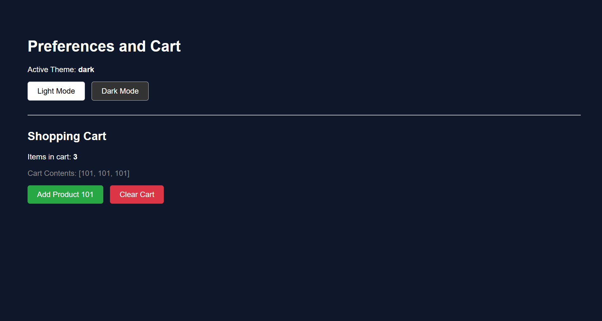
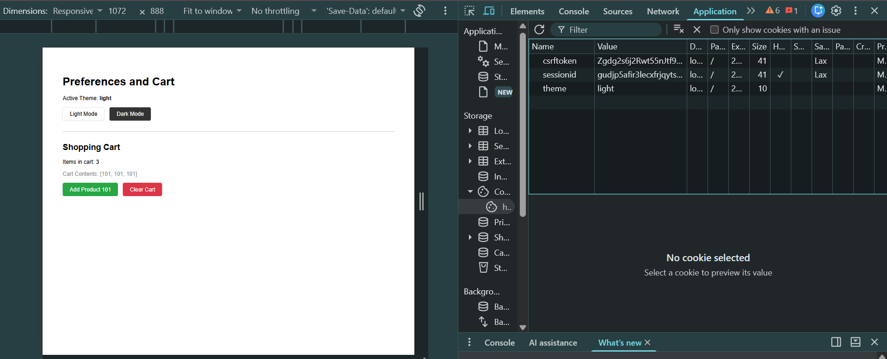

# Django Guided Lab: Preferences and Cart

This repository contains the completed code for the "Preferences and Cart" guided lab. The objective of this project is to demonstrate the correct usage of client-side **Cookies** (for UI preferences) and server-side **Sessions** (for application state and shopping carts).

## Data Flow & Architecture
This application relies on two distinct methods of data storage:
1.  **Theme (Cookies):** When a user selects a theme, the server sends an HTTP response containing a `Set-Cookie` header. The browser stores this value (`light` or `dark`) locally. On subsequent requests, the browser sends this cookie back to the server, allowing Django to render the correct CSS class. This data lives in the browser.
2.  **Cart (Sessions):** When a user adds an item to the cart, Django saves the product ID to the database (or server cache) under a unique Session ID. Django then gives the browser a secure cookie containing *only* the Session ID (not the cart data). When the user returns, Django reads the Session ID and retrieves the secure cart data from the backend.

## Step-by-Step Implementation

### Step 1 & 2: Home View and Reading Cookies
We created a central `home` view in `views.py`. This view intercepts incoming requests and uses `request.COOKIES.get('theme', 'light')` to check if the user has a saved preference. If no cookie is found, it defaults to the light theme.

### Step 3 & 4: Setting the Theme Cookie
We created a dynamic route (`/set-theme/<str:chosen_theme>/`) and a corresponding view. 
-   **Validation:** The view checks that the input is strictly `'light'` or `'dark'`.
-   **Persistence:** We calculate a 30-day expiration (`30 * 24 * 60 * 60` seconds) and attach it to a redirect response using `response.set_cookie()`.

### Step 5: Initializing the Session Cart
In the `home` view, we check for an existing shopping cart using `request.session.get('cart', [])`. If the user is new, they are assigned an empty list `[]`.

### Step 6: Adding Items to the Cart
We built an `add_to_cart` view that triggers when the user clicks the "Add Product 101" button. 
-   It retrieves the current cart list from the session.
-   It appends the new `product_id` to the list.
-   It saves the updated list back into `request.session['cart']`.

### Step 7: Clearing the Cart
The `clear_cart` view uses `request.session.pop('cart', [])` to completely remove the cart key from the session dictionary, effectively emptying the cart and resetting the count to zero.

### Step 8: Testing and Verification
The application state was verified using browser Developer Tools.

---

## 📸 Project Screenshots

> 

> 

---

### Where does each value live?
*   **The Theme (Cookie):** Lives strictly on the client-side (the user's browser). It is lightweight, non-sensitive, and persists even if the session ends.
*   **The Cart (Session):** Lives strictly on the server-side (the Django backend). It is protected from client tampering. The browser only holds a randomized `sessionid` key to access it.