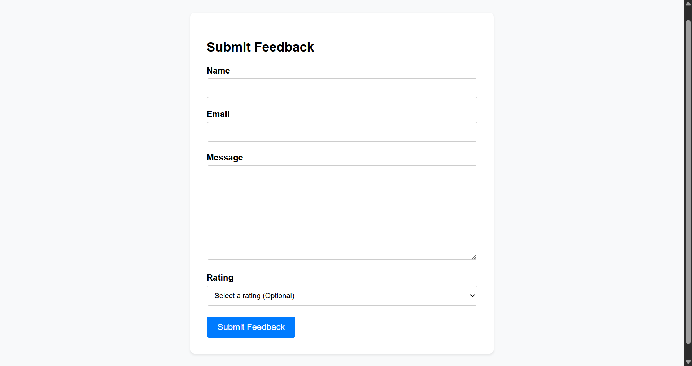
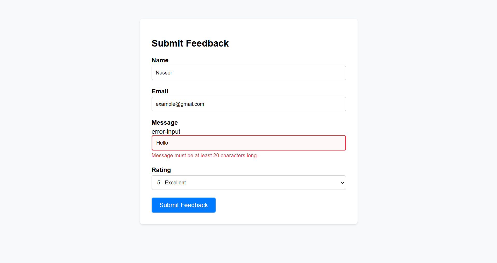
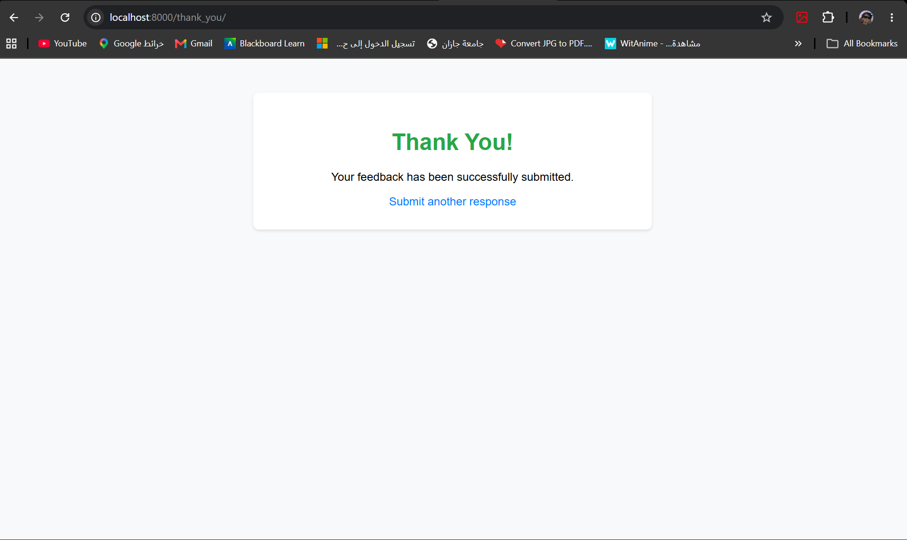

# Django Guided Lab: Feedback Form

This repository contains the completed code for the "Feedback Form" guided lab. The objective of this project is to build a robust Django form with custom backend validation, manual HTML rendering, and dynamic CSS error styling.

## Data Flow & Architecture
This application utilizes the Django Forms API to manage data validation and user feedback:
1.  **Form Initialization (GET):** The `contact_view` generates an empty `ContactForm` object and passes it to the `contact.html` template.
2.  **Manual Rendering:** The template iterates through the form fields using a `` loop, rendering each input manually to allow for precise CSS control.
3.  **Submission & Validation (POST):** Upon submission, data is sent to the backend. The custom `clean_message` method verifies the message length. If invalid, the form returns to the user with the errors attached. If valid, the user is redirected via an HTTP 302 response to the `thank_you` view to prevent double submissions.

## Step-by-Step Implementation

### Step 1: App Creation
The app was created using `python manage.py startapp feedback` and registered within the `INSTALLED_APPS` list in `settings.py`.

### Step 2 & 3: Form Definition and Custom Validation
A `ContactForm` class was built in `forms.py` utilizing standard fields (Char, Email, Textarea).
-   **Optional Rating:** Implemented via a `ChoiceField` with an empty default tuple to ensure it is not required.
-   **Custom Validation:** A `clean_message` method was added to enforce a strict minimum of 20 characters, raising a `forms.ValidationError` if the condition is not met.

### Step 4 & 5: Views and Redirection
The `views.py` file handles request routing:
-   `contact_view`: Processes both `GET` (display empty form) and `POST` (validate submission) requests.
-   `thank_you_view`: A simple view that renders the success page. A `redirect()` is used in the contact view upon valid POST to route users here.

### Step 6 & 8: Manual Rendering and CSS Highlighting
In `contact.html`:
-   The CSRF token is included for security.
-   Fields are rendered manually. A conditional `` block checks for validation failures. If errors exist, a custom `.error-input` CSS class (which applies a red border and background) is dynamically appended to the input widget.

### Step 7: Success Page
A straightforward `thank_you.html` template was created, providing clear confirmation to the user and a link to submit another response.

---

## 📸 Project Screenshots

> 

> 

> 