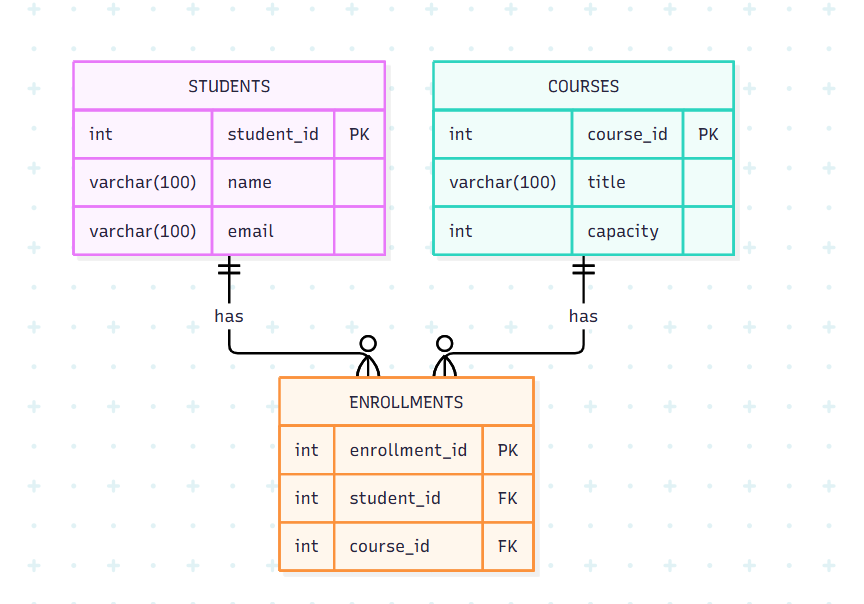

# Django Guided Lab: Course Registration Database Design

This repository contains the conceptual database design for a Course Registration system. The objective of this lab is to establish a solid relational data structure using entities, primary keys, and foreign keys before writing any Django model code.

## Database Schema & Architecture
The system is built on three core entities designed to eliminate data redundancy:
1.  **Students:** Stores unique student information.
2.  **Courses:** Stores available class information.
3.  **Enrollments:** Acts as a **junction (bridge) table** resolving the Many-to-Many relationship between students and courses into two **One-to-Many** relationships.

### Step-by-Step Implementation

*   **Step 1 & 2: Entities and Primary Keys (PK)**
    *   `STUDENTS` table created with `student_id` (PK).
    *   `COURSES` table created with `course_id` (PK).
    *   `ENROLLMENTS` table created with `enrollment_id` (PK).
*   **Step 3: Attributes**
    *   Added `name` and `email` to Students.
    *   Added `title` and `capacity` to Courses.
*   **Step 4: Foreign Keys (FK)**
    *   Placed `student_id` and `course_id` inside the `ENROLLMENTS` table to link the records.
*   **Step 5 & 6: Relationships**
    *   *Student to Enrollment:* One-to-Many (One student can have many enrollments).
    *   *Course to Enrollment:* One-to-Many (One course can have many enrollments).
*   **Step 7: Data Integrity Rules**
    *   **UNIQUE constraint:** Applied to the student `email` to prevent duplicate accounts.
    *   **NOT NULL constraint:** Applied to the student `name` to ensure a name is always provided.

---

## Entity-Relationship Diagram (Step 8)

>
---

## Exit Ticket Documentation

**Question:** *Explain why Enrollment should not store the student's name and course title repeatedly.*

**Answer:** 
Storing the student's name and course title directly in the Enrollment table causes **data redundancy**. This practice wastes database storage and creates update anomalies. For example, if a student changes their name or a course title is modified, the developer would have to manually find and update every single enrollment row associated with them. 

By utilizing **Foreign Keys** instead, we maintain a single source of truth. Updating a name once in the `STUDENTS` table automatically reflects across the entire system via the established relationships.